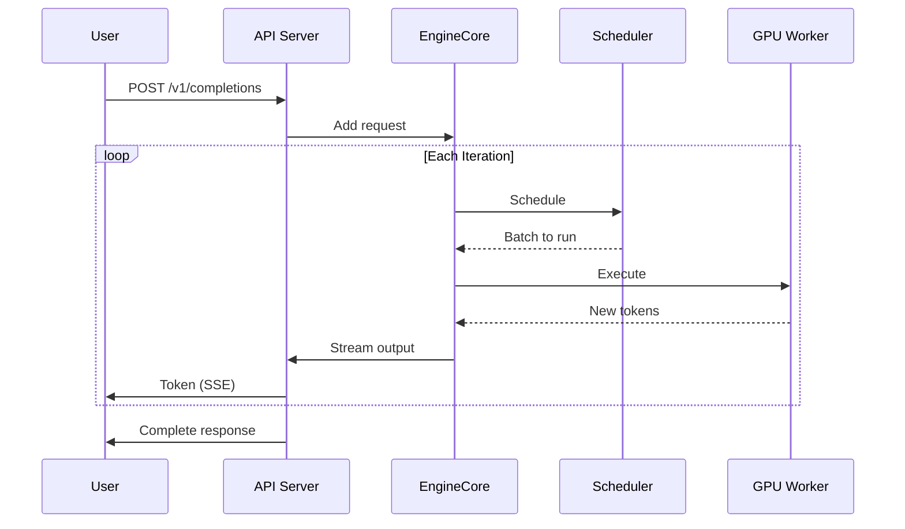

# Understanding vLLM: Architecture and Core Concepts

**Part 1 of the vLLM Technical Blog Series**
**Commit SHA:** `67745d189fd981ee824bde35666a3737a962c031`

---

## What You'll Learn

- vLLM's overall architectural pattern and why it was chosen
- Core abstractions: Engine, Scheduler, Worker, KV Cache Manager
- How requests flow from API to generated text
- Key design trade-offs and their implications

---

## Introduction

If you've worked with Large Language Model (LLM) serving, you've likely encountered a frustrating reality: GPUs sit idle while waiting for the slowest request in a batch to complete, and memory fragments into unusable chunks. vLLM tackles these problems with an architecture designed from the ground up for high-throughput, memory-efficient LLM inference.

In this post, we'll explore vLLM's architecture to understand how it achieves state-of-the-art serving throughput. We'll look at the core abstractions, trace a request through the system, and examine the trade-offs the vLLM team made along the way.

---

## The Architectural Pattern: Producer-Consumer Pipeline with Actor Model

vLLM's architecture is fundamentally a **producer-consumer pipeline** combined with **actor model principles**. But why this pattern instead of, say, a simple request-response server?

The answer lies in what makes LLM serving unique:

1. **Autoregressive generation** - Each token depends on all previous tokens
2. **Variable completion lengths** - Requests finish at different times
3. **Memory dominance** - KV cache consumes most GPU memory
4. **Batching benefits** - GPU throughput scales with batch size

A simple request-response model would waste GPU cycles waiting for slow requests. Instead, vLLM uses continuous batching where requests can join and leave the active batch at each token generation step.

Let's look at how this plays out in the code.

---

## Core Abstractions

### 1. EngineCore: The Scheduler's Home

The `EngineCore` is the heart of vLLM V1. It runs a tight loop that schedules requests, dispatches work to GPUs, and processes outputs.

```python
# From vllm/v1/engine/core.py
# https://github.com/vllm-project/vllm/blob/67745d189fd981ee824bde35666a3737a962c031/vllm/v1/engine/core.py#L120

class EngineCore:
    def __init__(self, vllm_config, executor_class, log_stats):
        self.scheduler = Scheduler(...)
        self.executor = executor_class(...)
        self.kv_cache_manager = KVCacheManager(...)

    def step(self):
        # 1. Schedule which requests to run
        scheduler_output = self.scheduler.schedule()

        # 2. Execute model on GPUs
        model_output = self.executor.execute_model(scheduler_output)

        # 3. Process outputs
        engine_outputs = self.process_outputs(model_output)

        return engine_outputs
```

The key insight is that scheduling happens at **iteration granularity**. Every time we generate tokens, we reconsider which requests to include in the batch.

### 2. Scheduler: The Decision Maker

The Scheduler answers the question: "Given our memory budget, which requests should run in this iteration?"

```python
# From vllm/v1/core/sched/scheduler.py
# https://github.com/vllm-project/vllm/blob/67745d189fd981ee824bde35666a3737a962c031/vllm/v1/core/sched/scheduler.py#L168

class Scheduler:
    def schedule(self):
        # Phase 1: Schedule running requests (decode)
        # Try to continue requests that are already generating
        running_scheduled = self._schedule_running()

        # Phase 2: Schedule waiting requests (prefill)
        # Bring in new requests if we have capacity
        waiting_scheduled = self._schedule_waiting()

        return SchedulerOutput(
            scheduled_requests=running_scheduled + waiting_scheduled,
            preempted_requests=...,
            finished_requests=...
        )
```

The scheduler maintains three queues:
- **Waiting**: New requests that haven't started generating
- **Running**: Active requests in the decode phase
- **Preempted**: Paused requests waiting to resume

### 3. KVCacheManager: Memory Maestro

The `KVCacheManager` manages GPU memory for attention key-value pairs using vLLM's signature PagedAttention approach (more on this in Part 2).

```python
# From vllm/v1/core/kv_cache_manager.py
# https://github.com/vllm-project/vllm/blob/67745d189fd981ee824bde35666a3737a962c031/vllm/v1/core/kv_cache_manager.py#L89

class KVCacheManager:
    def allocate_slots(self, request, num_tokens):
        # Allocate memory blocks for new tokens
        blocks = self.block_pool.allocate(num_blocks_needed)
        return BlockTable(blocks)

    def free(self, request):
        # Return blocks to free pool
        self.block_pool.free(request.blocks)
```

Instead of allocating contiguous memory for each sequence, it allocates fixed-size **blocks** that can be anywhere in GPU memory—just like OS virtual memory pages.

### 4. Executor and Workers: The Muscle

The Executor manages Workers, which actually run the model on GPUs.

```python
# From vllm/v1/executor/multiproc_executor.py
# https://github.com/vllm-project/vllm/blob/67745d189fd981ee824bde35666a3737a962c031/vllm/v1/executor/multiproc_executor.py#L67

class MultiprocExecutor:
    def __init__(self, vllm_config):
        # Spawn worker processes for each GPU
        self.workers = [
            WorkerProcess(rank=i, config=vllm_config)
            for i in range(num_gpus)
        ]

    def execute_model(self, scheduler_output):
        # Send work to all workers
        futures = [w.execute(scheduler_output) for w in self.workers]
        # Collect results
        return [f.result() for f in futures]
```

In distributed settings, workers coordinate via collective operations (all-reduce, etc.) managed by NCCL.

---

## Request Flow: From API to Generated Text

Let's trace a request through the system:



### Step-by-Step:

1. **Request Arrival**: User sends request to API server
2. **Tokenization**: Input is tokenized and validated
3. **Queue**: Request enters scheduler's waiting queue
4. **Schedule**: Scheduler selects requests for next iteration
5. **Execute**: Workers run model forward pass on GPU
6. **Sample**: Next tokens are sampled from logits
7. **Output**: Tokens streamed back to user
8. **Loop**: Repeat 4-7 until completion

The beauty is that at step 4, we can include tokens from many requests in one batch, maximizing GPU utilization.

---

## Design Trade-offs

Every architecture involves trade-offs. Here's what vLLM chose and why:

### Trade-off 1: Complexity for Throughput

**Choice:** Scheduling at iteration granularity instead of request granularity

**Benefit:** Continuous batching enables 10-20x higher throughput

**Cost:** More complex scheduler, state management for in-progress requests

### Trade-off 2: Memory Fragmentation for Flexibility

**Choice:** Block-based KV cache (PagedAttention) instead of contiguous allocation

**Benefit:** Near-zero memory waste, dynamic memory sharing

**Cost:** Additional indirection, block table management

### Trade-off 3: Message Passing for Isolation

**Choice:** Workers in separate processes communicating via IPC

**Benefit:** Fault isolation, clean GPU context management

**Cost:** Serialization overhead, more complex debugging

### Trade-off 4: Tight Coupling for Performance

**Choice:** Scheduler and KV cache manager tightly integrated

**Benefit:** Fast allocation/deallocation decisions

**Cost:** Harder to modify one without affecting the other

---

## Why Not Other Patterns?

You might wonder why vLLM didn't use other common patterns:

| Pattern | Why Not for vLLM |
|---------|------------------|
| **Microservices** | RPC latency too high for microsecond scheduling |
| **Event-Driven** | Batching requires synchronous scheduling decisions |
| **Layered** | Scheduler-executor feedback loop doesn't fit layers |
| **Hexagonal** | Inference loop is too performance-critical |

The producer-consumer pipeline fits because:
- Producer (API) and consumer (GPU) have different rates
- Scheduler acts as intelligent buffer between them
- Actor model (workers) enables distributed execution

---

## Practical Implications

Understanding the architecture helps you:

### 1. Debug Performance Issues

If throughput is low, check:
- Scheduler output sizes (are batches full?)
- KV cache utilization (is memory the bottleneck?)
- Worker timing (GPU or communication bound?)

### 2. Configure Appropriately

```python
# Example: Tune for throughput vs latency
from vllm import LLM

# High throughput: larger batches
llm = LLM(
    model="meta-llama/Llama-2-7b-hf",
    max_num_seqs=256,  # More concurrent requests
    max_model_len=4096,  # Longer contexts
)

# Low latency: smaller batches, faster scheduling
llm = LLM(
    model="meta-llama/Llama-2-7b-hf",
    max_num_seqs=32,  # Fewer concurrent requests
    enable_chunked_prefill=True,  # Don't block on long prompts
)
```

### 3. Extend the System

To add a new feature:
- **New model architecture**: Add to `model_executor/models/`
- **New attention backend**: Implement in `attention/backends/`
- **New API endpoint**: Extend `entrypoints/openai/`

---

## Key Takeaways

1. **vLLM uses a producer-consumer pipeline** optimized for scheduling-centric LLM inference

2. **Core abstractions** are EngineCore (loop), Scheduler (decisions), KVCacheManager (memory), and Workers (execution)

3. **Continuous batching** at token granularity maximizes GPU utilization

4. **PagedAttention** eliminates memory fragmentation through block-based allocation

5. **Trade-offs favor throughput** while maintaining reasonable complexity

---

## Next Steps

In [Part 2: Deep Dive into PagedAttention](02-deep-dive-pagedattention.md), we'll explore the memory management innovation that makes vLLM's performance possible. We'll see how treating KV cache like virtual memory enables 7x more concurrent requests.

---

## Code References

- **EngineCore:** [vllm/v1/engine/core.py](https://github.com/vllm-project/vllm/blob/67745d189fd981ee824bde35666a3737a962c031/vllm/v1/engine/core.py)
- **Scheduler:** [vllm/v1/core/sched/scheduler.py](https://github.com/vllm-project/vllm/blob/67745d189fd981ee824bde35666a3737a962c031/vllm/v1/core/sched/scheduler.py)
- **KVCacheManager:** [vllm/v1/core/kv_cache_manager.py](https://github.com/vllm-project/vllm/blob/67745d189fd981ee824bde35666a3737a962c031/vllm/v1/core/kv_cache_manager.py)
- **Executor:** [vllm/v1/executor/multiproc_executor.py](https://github.com/vllm-project/vllm/blob/67745d189fd981ee824bde35666a3737a962c031/vllm/v1/executor/multiproc_executor.py)

---

*This is Part 1 of the vLLM Technical Blog Series based on commit `67745d189fd981ee824bde35666a3737a962c031`.*
