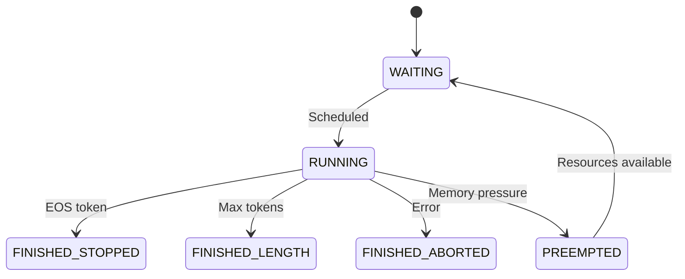

# Patterns and Practices in vLLM

**Part 3 of the vLLM Technical Blog Series**
**Commit SHA:** `67745d189fd981ee824bde35666a3737a962c031`

---

## What You'll Learn

- Design patterns employed throughout vLLM
- Code organization and module structure
- Testing approaches and fixtures
- Error handling and resilience patterns

---

## Introduction

vLLM is a substantial codebase—over 400,000 lines of Python and 50,000 lines of CUDA. Maintaining coherence at this scale requires consistent patterns and practices. In this post, we'll explore the patterns vLLM uses to stay organized, testable, and maintainable.

---

## Design Patterns

### 1. Plugin/Strategy Pattern: Attention Backends

vLLM supports 33+ attention backends (FlashAttention, FlashInfer, Triton, etc.). Rather than hardcoding each, it uses a plugin pattern:

```python
# From vllm/attention/selector.py (simplified)
# https://github.com/vllm-project/vllm/blob/67745d189fd981ee824bde35666a3737a962c031/vllm/attention/selector.py

class AttentionSelector:
    """Selects the appropriate attention backend."""

    _backends = {
        "FLASH_ATTN": FlashAttentionBackend,
        "FLASHINFER": FlashInferBackend,
        "TRITON": TritonBackend,
        # ... 30+ more
    }

    @classmethod
    def get_backend(cls, backend_name, model_config):
        backend_class = cls._backends[backend_name]
        return backend_class(model_config)
```

**Why this pattern?**
- Easy to add new backends without modifying core code
- Runtime selection based on hardware/model
- Each backend encapsulates its complexity

**Usage:**

```python
# From vllm/attention/layer.py
class Attention(nn.Module):
    def __init__(self, ...):
        self.backend = AttentionSelector.get_backend(
            backend_name=get_attn_backend(),
            model_config=model_config
        )

    def forward(self, query, key, value):
        return self.backend.forward(query, key, value)
```

### 2. State Machine Pattern: Request Lifecycle

Requests have a well-defined lifecycle with explicit states:

```python
# From vllm/v1/request.py
# https://github.com/vllm-project/vllm/blob/67745d189fd981ee824bde35666a3737a962c031/vllm/v1/request.py

class RequestStatus(enum.Enum):
    WAITING = "waiting"
    RUNNING = "running"
    PREEMPTED = "preempted"
    FINISHED_STOPPED = "finished_stopped"
    FINISHED_LENGTH = "finished_length"
    FINISHED_ABORTED = "finished_aborted"
    FINISHED_IGNORED = "finished_ignored"

class Request:
    def __init__(self, ...):
        self.status = RequestStatus.WAITING

    def is_finished(self):
        return self.status in (
            RequestStatus.FINISHED_STOPPED,
            RequestStatus.FINISHED_LENGTH,
            RequestStatus.FINISHED_ABORTED,
            RequestStatus.FINISHED_IGNORED,
        )
```

**State transitions:**



**Why this pattern?**
- Clear semantics for each state
- Easy to reason about valid transitions
- Simplifies scheduler logic

### 3. Registry Pattern: Model Registration

Over 150 model architectures are registered for dynamic loading:

```python
# From vllm/model_executor/models/registry.py
# https://github.com/vllm-project/vllm/blob/67745d189fd981ee824bde35666a3737a962c031/vllm/model_executor/models/registry.py

_MODELS = {
    "LlamaForCausalLM": ("llama", "LlamaForCausalLM"),
    "MistralForCausalLM": ("mistral", "MistralForCausalLM"),
    "Qwen2VLForConditionalGeneration": ("qwen2_vl", "Qwen2VLForConditionalGeneration"),
    # ... 150+ more
}

def get_model_class(model_arch):
    """Get model class by architecture name."""
    module_name, class_name = _MODELS[model_arch]
    module = importlib.import_module(f"vllm.model_executor.models.{module_name}")
    return getattr(module, class_name)
```

**Why this pattern?**
- Lazy loading (don't import all models at startup)
- Central registration point
- Easy to add new models

### 4. Builder Pattern: Configuration

vLLM's configuration involves many interdependent settings. The builder pattern handles validation:

```python
# From vllm/engine/arg_utils.py (simplified)
# https://github.com/vllm-project/vllm/blob/67745d189fd981ee824bde35666a3737a962c031/vllm/engine/arg_utils.py

@dataclass
class EngineArgs:
    model: str
    tensor_parallel_size: int = 1
    max_model_len: Optional[int] = None
    # ... many more

    def create_engine_config(self):
        """Build validated configuration."""
        model_config = ModelConfig(
            model=self.model,
            ...
        )
        cache_config = CacheConfig(
            block_size=self.block_size,
            ...
        )
        # Cross-validate
        self._validate_configs(model_config, cache_config)

        return VllmConfig(
            model_config=model_config,
            cache_config=cache_config,
            ...
        )
```

**Why this pattern?**
- Complex validation logic in one place
- Cross-config dependencies handled
- Immutable output configuration

---

## Code Organization

### Module Structure

vLLM follows a clear hierarchical structure:

```
vllm/
├── entrypoints/      # API layer (user-facing)
├── v1/
│   ├── engine/       # Core engine loop
│   ├── core/         # Scheduler, KV cache
│   ├── worker/       # GPU execution
│   └── executor/     # Worker management
├── model_executor/   # Model implementations
│   ├── models/       # Architecture implementations
│   └── layers/       # Reusable layers
├── attention/        # Attention backends
├── distributed/      # Communication
└── config/           # Configuration classes
```

**Principles:**
- **User-facing vs internal:** `entrypoints/` is the public API
- **Horizontal layers:** Each directory is a horizontal slice
- **Feature modules:** `attention/`, `lora/`, `multimodal/` are feature areas

### Import Conventions

```python
# Good: Import from public module
from vllm import LLM, SamplingParams

# Internal: Import specific implementations
from vllm.v1.engine.core import EngineCore
from vllm.model_executor.models.llama import LlamaForCausalLM
```

### Configuration Dataclasses

All configurations use Python dataclasses with Pydantic validation:

```python
# From vllm/config/model.py
from vllm.config.config_base import config

@config
class ModelConfig:
    """Configuration for the model."""
    model: str
    tokenizer: Optional[str] = None
    max_model_len: Optional[int] = None

    def __post_init__(self):
        # Validation logic
        if self.max_model_len is not None and self.max_model_len <= 0:
            raise ValueError("max_model_len must be positive")
```

---

## Testing Practices

### Test Organization

Tests mirror the source structure:

```
tests/
├── v1/               # V1 engine tests
├── entrypoints/      # API tests
├── models/           # Model correctness tests
├── distributed/      # Multi-GPU tests
├── kernels/          # CUDA kernel tests
└── conftest.py       # Shared fixtures
```

### Key Fixtures

vLLM provides rich test fixtures in `tests/conftest.py`:

```python
# From tests/conftest.py
# https://github.com/vllm-project/vllm/blob/67745d189fd981ee824bde35666a3737a962c031/tests/conftest.py

@pytest.fixture
def vllm_runner():
    """Fixture for running vLLM inference."""
    return VllmRunner

class VllmRunner:
    def __init__(self, model_name, **kwargs):
        self.model = LLM(model_name, **kwargs)

    def generate(self, prompts, sampling_params):
        return self.model.generate(prompts, sampling_params)

    def __enter__(self):
        return self

    def __exit__(self, *args):
        del self.model
        cleanup_dist_env_and_memory()
```

```python
# From tests/conftest.py
@pytest.fixture
def hf_runner():
    """Fixture for HuggingFace baseline comparison."""
    return HfRunner

class HfRunner:
    """Run HuggingFace models for comparison."""
    def __init__(self, model_name, **kwargs):
        self.model = AutoModelForCausalLM.from_pretrained(model_name)
        self.tokenizer = AutoTokenizer.from_pretrained(model_name)
```

### Testing Strategy

**1. Correctness tests:** Compare vLLM output to HuggingFace

```python
def test_model_correctness(vllm_runner, hf_runner):
    prompt = "Hello, world!"

    vllm_output = vllm_runner.generate([prompt], SamplingParams(max_tokens=10))
    hf_output = hf_runner.generate([prompt], max_new_tokens=10)

    # Outputs should match (within tolerance for sampling)
    assert_close(vllm_output, hf_output)
```

**2. Benchmark tests:** Performance regression detection

```python
@pytest.mark.benchmark
def test_throughput_regression(benchmark):
    llm = LLM("meta-llama/Llama-2-7b-hf")
    result = benchmark(llm.generate, prompts, sampling_params)
    assert result.throughput > MINIMUM_THROUGHPUT
```

**3. Distributed tests:** Multi-GPU coordination

```python
@pytest.mark.distributed
def test_tensor_parallel():
    # Run with: torchrun --nproc_per_node=2 -m pytest
    llm = LLM("meta-llama/Llama-2-7b-hf", tensor_parallel_size=2)
    output = llm.generate(["Test prompt"])
    assert output is not None
```

### Test Markers

```python
# In pyproject.toml
[tool.pytest.ini_options]
markers = [
    "slow_test",        # Takes >30 seconds
    "core_model",       # Run in every PR
    "distributed",      # Requires multi-GPU
    "skip_v1",          # Doesn't work with V1 engine
    "optional",         # Skip by default
]
```

---

## Error Handling

### Exception Hierarchy

```python
# Custom exceptions for different error types
class VLLMError(Exception):
    """Base class for vLLM errors."""
    pass

class EngineDeadError(VLLMError):
    """Engine process has crashed."""
    pass

class EngineGenerateError(VLLMError):
    """Error during generation."""
    pass

class InputProcessingError(VLLMError):
    """Error processing input."""
    pass
```

### Error Propagation

Errors propagate from workers to engine to API:

```python
# In worker
try:
    output = self.model_runner.execute(inputs)
except Exception as e:
    return WorkerOutput(error=str(e))

# In engine
if worker_output.error:
    request.status = RequestStatus.FINISHED_ABORTED
    raise EngineGenerateError(worker_output.error)

# In API
try:
    async for output in engine.generate(request):
        yield output
except EngineGenerateError as e:
    return JSONResponse(status_code=500, content={"error": str(e)})
```

### Resilience Patterns

**1. Health checks:**

```python
# From vllm/entrypoints/openai/api_server.py
@router.get("/health")
async def health():
    try:
        await engine_client.check_health()
        return Response(status_code=200)
    except EngineDeadError:
        return Response(status_code=503)
```

**2. Graceful degradation:**

```python
# Preemption instead of OOM
if not kv_cache_manager.can_allocate(request, num_tokens):
    # Preempt lower priority requests
    preempted = scheduler.preempt_requests(num_blocks_needed)
    if preempted:
        # Retry allocation
        return kv_cache_manager.allocate(request, num_tokens)
    else:
        # Can't proceed, wait
        return None
```

---

## Logging Patterns

### Scoped Logging

vLLM extends Python logging with scope control:

```python
# From vllm/logger.py
# https://github.com/vllm-project/vllm/blob/67745d189fd981ee824bde35666a3737a962c031/vllm/logger.py

# Log only from rank 0 (avoid duplicate messages in distributed)
logger.info_once("Model loaded successfully", scope="global")

# Log from each node's rank 0
logger.warning_once("High memory usage", scope="local")

# Log from all processes
logger.debug("Processing request", scope="process")
```

### Structured Logging

```python
# Using python-json-logger for structured output
import logging
from pythonjsonlogger import jsonlogger

logger = logging.getLogger("vllm")
handler = logging.StreamHandler()
handler.setFormatter(jsonlogger.JsonFormatter())
logger.addHandler(handler)

logger.info("Request processed", extra={
    "request_id": "req-123",
    "latency_ms": 45.2,
    "tokens_generated": 128
})
```

---

## Code Quality Practices

### Type Hints

vLLM uses comprehensive type hints:

```python
def generate(
    self,
    prompts: Union[str, List[str]],
    sampling_params: Optional[SamplingParams] = None,
    use_tqdm: bool = True,
) -> List[RequestOutput]:
    """Generate completions for prompts."""
    ...
```

### Linting

Configured in `pyproject.toml`:

```toml
[tool.ruff.lint]
select = [
    "E",    # pycodestyle
    "F",    # Pyflakes
    "UP",   # pyupgrade
    "B",    # flake8-bugbear
    "SIM",  # flake8-simplify
    "I",    # isort
    "G",    # flake8-logging-format
]
```

### Documentation

```python
def allocate_slots(
    self,
    request: Request,
    num_tokens: int,
) -> SlotMapping:
    """Allocate KV cache slots for new tokens.

    Args:
        request: The request to allocate for.
        num_tokens: Number of new tokens to allocate.

    Returns:
        SlotMapping containing block tables and slot assignments.

    Raises:
        ValueError: If num_tokens is negative.
        MemoryError: If allocation fails.
    """
    ...
```

---

## Key Takeaways

1. **Plugin pattern** enables 33+ attention backends without core changes

2. **State machine pattern** makes request lifecycle explicit and debuggable

3. **Registry pattern** supports 150+ models with lazy loading

4. **Builder pattern** handles complex configuration validation

5. **Comprehensive fixtures** (VllmRunner, HfRunner) enable correctness testing

6. **Scoped logging** prevents log spam in distributed settings

7. **Type hints and linting** maintain code quality at scale

---

## Next Steps

In [Part 4: Extending and Integrating](04-extending-integrating.md), we'll see how to use these patterns to add new models, attention backends, and API endpoints to vLLM.

---

## Code References

- **Attention Selector:** [vllm/attention/selector.py](https://github.com/vllm-project/vllm/blob/67745d189fd981ee824bde35666a3737a962c031/vllm/attention/selector.py)
- **Request States:** [vllm/v1/request.py](https://github.com/vllm-project/vllm/blob/67745d189fd981ee824bde35666a3737a962c031/vllm/v1/request.py)
- **Model Registry:** [vllm/model_executor/models/registry.py](https://github.com/vllm-project/vllm/blob/67745d189fd981ee824bde35666a3737a962c031/vllm/model_executor/models/registry.py)
- **Test Fixtures:** [tests/conftest.py](https://github.com/vllm-project/vllm/blob/67745d189fd981ee824bde35666a3737a962c031/tests/conftest.py)
- **Logger:** [vllm/logger.py](https://github.com/vllm-project/vllm/blob/67745d189fd981ee824bde35666a3737a962c031/vllm/logger.py)

---

*This is Part 3 of the vLLM Technical Blog Series based on commit `67745d189fd981ee824bde35666a3737a962c031`.*
